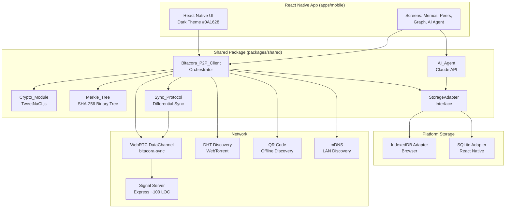
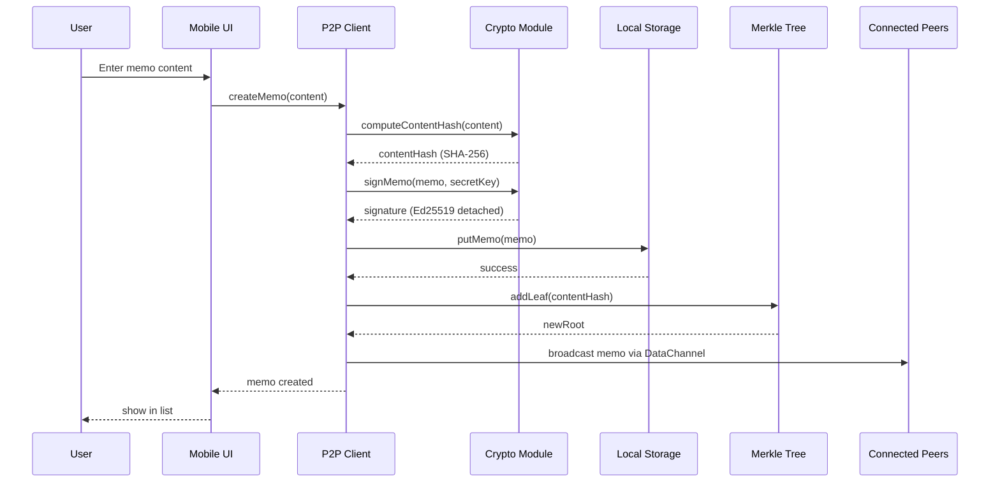
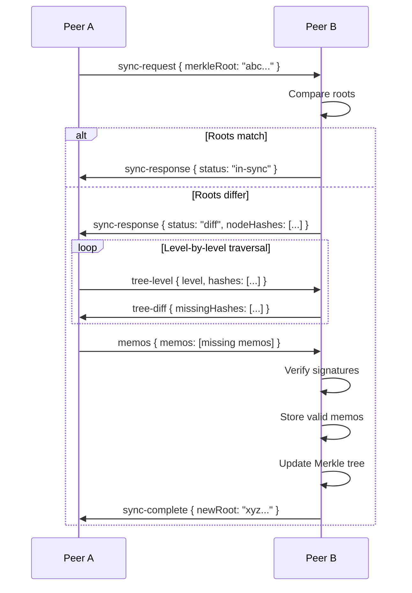
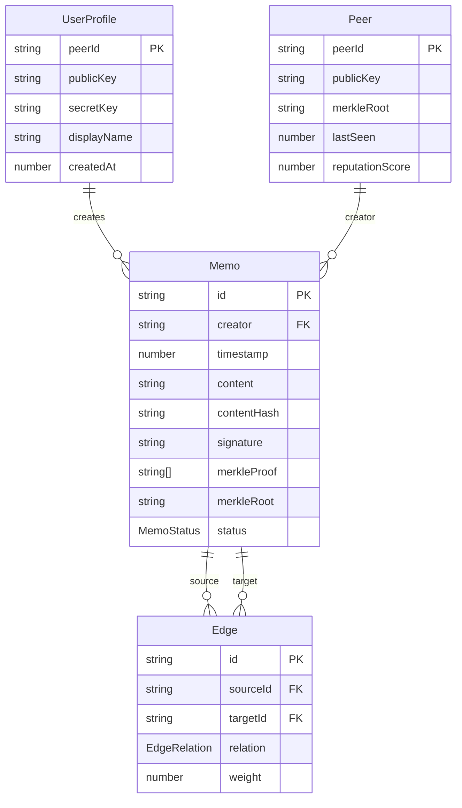

# Design Document — Bitácora P2P

## Overview

This design transforms the existing Bitácora app from a client-server model into a fully client-side, peer-to-peer architecture. Peers communicate directly via WebRTC, store data locally (IndexedDB on browser, SQLite on React Native), synchronize using a Merkle tree-based differential sync protocol, and cryptographically sign all contributions with Ed25519 (TweetNaCl.js). An optional stateless signal server (~100 lines Express) facilitates initial WebRTC handshake only. An on-device AI agent (Claude API) provides consensus synthesis, contradiction detection, and graph reasoning.

The implementation lives primarily in `packages/shared/src/` as platform-agnostic TypeScript modules, with platform-specific storage adapters and React Native UI in `apps/mobile/`.

### Key Design Decisions

1. **All P2P logic in `packages/shared`**: The core modules (crypto, Merkle tree, sync protocol, storage interface, P2P client) are pure TypeScript with no React Native dependencies, enabling reuse across `apps/mobile` and `apps/web`.
2. **TweetNaCl.js only**: No additional crypto libraries. Ed25519 for signing, Curve25519 for optional encryption. ~100KB gzipped.
3. **Custom Merkle tree**: A balanced binary Merkle tree over sorted `contentHash` values. No external dependency. ~20KB.
4. **Storage adapter pattern**: A `StorageAdapter` interface with IndexedDB and SQLite implementations, selected at runtime via platform detection.
5. **Deterministic conflict resolution**: Timestamp-first, then lexicographic contentHash comparison. No CRDTs needed for this use case.
6. **Stateless signal server**: Express server holds in-memory peer map only during process lifetime. Zero persistence.

## Architecture



### Data Flow — Memo Creation



### Data Flow — Sync Protocol



## Components and Interfaces

### 1. Core Data Types (`packages/shared/src/types.ts`)

```typescript
export type MemoStatus = 'pending' | 'verified' | 'disputed';
export type EdgeRelation = 'supports' | 'contradicts' | 'relates_to';

export interface Memo {
  id: string;              // UUID v4
  creator: string;         // peerId of creator
  timestamp: number;       // Unix epoch ms
  content: string;
  contentHash: string;     // SHA-256 hex of content
  signature: string;       // Ed25519 detached signature hex
  merkleProof: string[];   // Proof path hashes
  merkleRoot: string;      // Root at time of creation
  status: MemoStatus;
}

export interface Edge {
  id: string;              // UUID v4
  sourceId: string;        // Memo id
  targetId: string;        // Memo id
  relation: EdgeRelation;
  weight: number;          // 0..1
}

export interface Peer {
  peerId: string;
  publicKey: string;       // Ed25519 public key hex
  merkleRoot: string;
  lastSeen: number;        // Unix epoch ms
  reputationScore: number; // 0..1
}

export interface UserProfile {
  peerId: string;
  publicKey: string;       // Ed25519 public key hex
  secretKey: string;       // Ed25519 secret key hex
  displayName: string;
  createdAt: number;       // Unix epoch ms
}
```

### 2. Crypto Module (`packages/shared/src/crypto.ts`)

```typescript
export interface CryptoModule {
  generateKeypair(): { publicKey: Uint8Array; secretKey: Uint8Array };
  derivePeerId(publicKey: Uint8Array): string;
  computeContentHash(content: string): Promise<string>;
  signMemo(memo: Pick<Memo, 'id' | 'creator' | 'timestamp' | 'contentHash'>, secretKey: Uint8Array): string;
  verifySignature(memo: Pick<Memo, 'id' | 'creator' | 'timestamp' | 'contentHash' | 'signature'>, publicKey: Uint8Array): boolean;
  deriveSharedSecret(localSecretKey: Uint8Array, remotePublicKey: Uint8Array): Uint8Array;
  encrypt(message: Uint8Array, sharedSecret: Uint8Array): Uint8Array;
  decrypt(ciphertext: Uint8Array, sharedSecret: Uint8Array): Uint8Array;
}
```

Implementation uses:
- `tweetnacl.sign.keyPair()` for Ed25519 keypair generation
- `tweetnacl.sign.detached()` / `tweetnacl.sign.detached.verify()` for signing/verification
- `tweetnacl.box.before()` for Curve25519 shared secret derivation
- `tweetnacl.secretbox()` / `tweetnacl.secretbox.open()` for symmetric encryption
- Web Crypto API `crypto.subtle.digest('SHA-256', ...)` for content hashing

### 3. Storage Adapter (`packages/shared/src/storage.ts`)

```typescript
export interface StorageAdapter {
  // Memos
  putMemo(memo: Memo): Promise<void>;
  getMemo(id: string): Promise<Memo | null>;
  getAllMemos(): Promise<Memo[]>;
  deleteMemo(id: string): Promise<void>;

  // Edges
  putEdge(edge: Edge): Promise<void>;
  getEdge(id: string): Promise<Edge | null>;
  getEdgesByMemo(memoId: string): Promise<Edge[]>;

  // Peers
  putPeer(peer: Peer): Promise<void>;
  getPeer(peerId: string): Promise<Peer | null>;
  getAllPeers(): Promise<Peer[]>;

  // Profile
  getProfile(): Promise<UserProfile | null>;
  putProfile(profile: UserProfile): Promise<void>;

  // Lifecycle
  initialize(): Promise<void>;
  close(): Promise<void>;
}
```

**IndexedDB Implementation** (`packages/shared/src/storage-indexeddb.ts`):
- Database: `"bitacora-p2p"`, version 1
- Object stores: `memos` (keyPath: `id`, indexes: `creator`, `timestamp`, `contentHash`), `edges` (keyPath: `id`, indexes: `sourceId`, `targetId`), `peers` (keyPath: `peerId`, index: `lastSeen`), `userProfile` (keyPath: `peerId`)
- All writes use single transactions for atomicity

**SQLite Implementation** (`packages/shared/src/storage-sqlite.ts`):
- Database file: `"bitacora-p2p.db"`
- Uses `expo-sqlite` for React Native
- Tables mirror IndexedDB stores with equivalent indexes
- All writes use `BEGIN/COMMIT` transactions

**Platform Detection** (`packages/shared/src/storage-factory.ts`):
```typescript
export function createStorage(): StorageAdapter {
  if (typeof window !== 'undefined' && 'indexedDB' in window) {
    return new IndexedDBStorage();
  }
  return new SQLiteStorage();
}
```

### 4. Merkle Tree (`packages/shared/src/merkle.ts`)

```typescript
export interface MerkleNode {
  hash: string;
  left?: MerkleNode;
  right?: MerkleNode;
}

export interface MerkleTree {
  root: string;                                    // 64-char hex root hash
  build(contentHashes: string[]): void;            // Build from sorted hashes
  addLeaf(contentHash: string): void;              // Insert + recompute path
  removeLeaf(contentHash: string): void;           // Remove + recompute path
  getProof(contentHash: string): string[];         // Proof path for a leaf
  verifyProof(contentHash: string, proof: string[], root: string): boolean;
  getNodeHashesAtLevel(level: number): string[];   // For diff sync
  findDivergentSubtrees(remoteHashes: string[], level: number): string[];
}
```

Implementation details:
- Leaves are the sorted `contentHash` values of all local Memos
- Internal nodes: `SHA-256(leftChild.hash + rightChild.hash)`
- Tree is always balanced (pad with empty hash if odd number of leaves)
- Sorting ensures same set of memos → same tree regardless of insertion order (confluence)
- Root is a 64-character hex string

### 5. Sync Protocol (`packages/shared/src/sync.ts`)

```typescript
export interface SyncMessage {
  type: 'sync-request' | 'sync-response' | 'tree-level' | 'tree-diff' | 'memos' | 'sync-complete';
  payload: unknown;
}

export interface SyncProtocol {
  initSync(remotePeerId: string): Promise<void>;
  handleMessage(message: SyncMessage, fromPeerId: string): Promise<SyncMessage | null>;
  getStatus(): 'idle' | 'syncing' | 'complete' | 'error';
}
```

Sync flow:
1. Exchange Merkle roots (O(1) comparison)
2. If roots match → done
3. If roots differ → level-by-level hash exchange to find divergent subtrees (O(log n))
4. Request only missing memos from divergent leaves
5. Verify signatures on received memos before storing
6. Update local Merkle tree with new leaves

### 6. P2P Client (`packages/shared/src/p2p-client.ts`)

```typescript
export interface P2PClient {
  initialize(storage: StorageAdapter, crypto: CryptoModule): Promise<void>;
  connectToPeer(peerId: string, offer?: RTCSessionDescriptionInit): Promise<void>;
  disconnectFromPeer(peerId: string): void;
  broadcastMemo(memo: Memo): void;
  broadcastEdge(edge: Edge): void;
  getConnectedPeers(): string[];
  onPeerConnected(callback: (peerId: string) => void): void;
  onPeerDisconnected(callback: (peerId: string) => void): void;
  onMemoReceived(callback: (memo: Memo) => void): void;
  onSyncStatusChanged(callback: (peerId: string, status: string) => void): void;
}
```

WebRTC configuration:
- Data channel name: `"bitacora-sync"`
- Ordered delivery: `true`
- JSON-encoded messages with `type` field
- Reconnection: exponential backoff (1s initial, 30s max)

### 7. Signal Server (`signal-server/index.ts`)

```typescript
// ~100 lines Express server
// POST /offer   — store SDP offer by peerId
// POST /answer  — store SDP answer by peerId  
// POST /icecandidate — relay ICE candidate to target peer
// In-memory Map<string, PeerSignalData>, no persistence
```

### 8. AI Agent (`packages/shared/src/ai-agent.ts`)

```typescript
export interface AIAgent {
  synthesizeConsensus(topic: string, memos: Memo[], edges: Edge[]): Promise<ConsensusSynthesis>;
  detectContradictions(memos: Memo[], edges: Edge[]): Promise<Contradiction[]>;
  analyzeGraph(memos: Memo[], edges: Edge[]): Promise<GraphInsights>;
}

export interface ConsensusSynthesis {
  statement: string;
  supportingMemoIds: string[];
  confidenceLevel: 'high' | 'medium' | 'low';
}

export interface Contradiction {
  memoA: string;  // Memo id
  memoB: string;  // Memo id
  explanation: string;
}

export interface GraphInsights {
  mostConnected: string[];      // Memo ids
  strongestChains: string[][];  // Paths of Memo ids
  isolatedClusters: string[][]; // Groups of Memo ids
  suggestedEdges: Array<{ sourceId: string; targetId: string; relation: EdgeRelation }>;
}
```

## Data Models

### Entity Relationship Diagram



### IndexedDB Schema

| Object Store | Key Path | Indexes |
|---|---|---|
| `memos` | `id` | `creator`, `timestamp`, `contentHash` |
| `edges` | `id` | `sourceId`, `targetId` |
| `peers` | `peerId` | `lastSeen` |
| `userProfile` | `peerId` | — |

### SQLite Schema

```sql
CREATE TABLE memos (
  id TEXT PRIMARY KEY,
  creator TEXT NOT NULL,
  timestamp INTEGER NOT NULL,
  content TEXT NOT NULL,
  contentHash TEXT NOT NULL,
  signature TEXT NOT NULL,
  merkleProof TEXT NOT NULL,  -- JSON array
  merkleRoot TEXT NOT NULL,
  status TEXT NOT NULL CHECK(status IN ('pending','verified','disputed'))
);
CREATE INDEX idx_memos_creator ON memos(creator);
CREATE INDEX idx_memos_timestamp ON memos(timestamp);
CREATE INDEX idx_memos_contentHash ON memos(contentHash);

CREATE TABLE edges (
  id TEXT PRIMARY KEY,
  sourceId TEXT NOT NULL REFERENCES memos(id),
  targetId TEXT NOT NULL REFERENCES memos(id),
  relation TEXT NOT NULL CHECK(relation IN ('supports','contradicts','relates_to')),
  weight REAL NOT NULL CHECK(weight >= 0 AND weight <= 1)
);
CREATE INDEX idx_edges_sourceId ON edges(sourceId);
CREATE INDEX idx_edges_targetId ON edges(targetId);

CREATE TABLE peers (
  peerId TEXT PRIMARY KEY,
  publicKey TEXT NOT NULL,
  merkleRoot TEXT NOT NULL,
  lastSeen INTEGER NOT NULL,
  reputationScore REAL NOT NULL CHECK(reputationScore >= 0 AND reputationScore <= 1)
);
CREATE INDEX idx_peers_lastSeen ON peers(lastSeen);

CREATE TABLE userProfile (
  peerId TEXT PRIMARY KEY,
  publicKey TEXT NOT NULL,
  secretKey TEXT NOT NULL,
  displayName TEXT NOT NULL,
  createdAt INTEGER NOT NULL
);
```

### Data Channel Message Protocol

```typescript
type DataChannelMessage =
  | { type: 'sync-request'; payload: { merkleRoot: string } }
  | { type: 'sync-response'; payload: { status: 'in-sync' } | { status: 'diff'; nodeHashes: string[] } }
  | { type: 'tree-level'; payload: { level: number; hashes: string[] } }
  | { type: 'tree-diff'; payload: { missingHashes: string[] } }
  | { type: 'memos'; payload: { memos: Memo[] } }
  | { type: 'edges'; payload: { edges: Edge[] } }
  | { type: 'sync-complete'; payload: { newRoot: string } }
  | { type: 'memo'; payload: Memo }
  | { type: 'edge'; payload: Edge };
```


## Correctness Properties

*A property is a characteristic or behavior that should hold true across all valid executions of a system — essentially, a formal statement about what the system should do. Properties serve as the bridge between human-readable specifications and machine-verifiable correctness guarantees.*

### Property 1: Content hash integrity

*For any* content string, when a Memo is created with that content, the `contentHash` field SHALL equal the SHA-256 hex digest of the content string.

**Validates: Requirements 1.2**

### Property 2: Entity ID uniqueness

*For any* collection of generated Memos and Edges, all `id` fields SHALL be valid UUID v4 strings and no two entities SHALL share the same `id`.

**Validates: Requirements 1.4, 2.3**

### Property 3: Edge reference validation

*For any* Edge where `sourceId` or `targetId` does not reference an existing Memo in Local_Storage, creation SHALL be rejected. *For any* Edge where both references are valid, creation SHALL succeed.

**Validates: Requirements 2.2**

### Property 4: Memo storage round-trip

*For any* valid Memo object, calling `putMemo(memo)` then `getMemo(memo.id)` SHALL return an object deeply equal to the original Memo.

**Validates: Requirements 5.5, 6.5, 7.3**

### Property 5: Edge storage round-trip

*For any* valid Edge object (with valid Memo references), calling `putEdge(edge)` then `getEdge(edge.id)` SHALL return an object deeply equal to the original Edge.

**Validates: Requirements 7.4**

### Property 6: Keypair generation invariants

*For any* generated Ed25519 keypair, the public key SHALL be 32 bytes, the secret key SHALL be 64 bytes, and the derived `peerId` SHALL equal the hex encoding of the first 16 bytes of the public key.

**Validates: Requirements 8.2, 8.4**

### Property 7: Sign/verify round-trip

*For any* valid Memo fields and Ed25519 keypair, signing the Memo with the secret key and then verifying the signature with the corresponding public key SHALL return `true`.

**Validates: Requirements 9.1, 10.1, 10.4**

### Property 8: Tampered signature rejection

*For any* signed Memo, if the signature, content, or creator field is modified after signing, verification with the original public key SHALL return `false`.

**Validates: Requirements 10.2**

### Property 9: Merkle tree root changes on mutation

*For any* non-empty Merkle tree and any content hash not already in the tree, adding that hash SHALL change the root. *For any* content hash in the tree, removing it SHALL change the root.

**Validates: Requirements 11.3**

### Property 10: Merkle tree confluence

*For any* set of content hashes and any two permutations of that set, constructing the Merkle tree from each permutation SHALL produce the same root hash.

**Validates: Requirements 11.5**

### Property 11: QR code payload round-trip

*For any* valid peerId, publicKey, and SDP offer string, encoding them into a QR code payload and then decoding SHALL recover the original peerId, publicKey, and SDP offer.

**Validates: Requirements 16.1, 16.2**

### Property 12: Sync transfers exactly the set difference

*For any* two distinct sets of signed Memos held by Peer A and Peer B, running the Sync_Protocol SHALL result in exactly the memos in `A \ B` being transferred to B and the memos in `B \ A` being transferred to A (i.e., only missing memos are exchanged).

**Validates: Requirements 18.3, 19.1, 19.3**

### Property 13: Sync convergence

*For any* two peers with different Memo sets, after a complete sync both peers' Merkle trees SHALL have the same root hash.

**Validates: Requirements 19.5**

### Property 14: Conflict resolution confluence

*For any* two Memos with the same `id` but different `contentHash`, resolving the conflict SHALL be deterministic: the Memo with the earlier timestamp wins, and if timestamps are equal, the Memo with the lexicographically smaller `contentHash` wins. Presenting the same two Memos in either order SHALL produce the same resolution.

**Validates: Requirements 20.1, 20.2, 20.3**

### Property 15: Encrypt/decrypt round-trip

*For any* message byte array and any two Ed25519 keypairs (A, B), deriving the shared secret from A's secret key and B's public key, then encrypting and decrypting the message with that shared secret SHALL produce the original message. Additionally, the shared secret derived from (A.secret, B.public) SHALL equal the shared secret derived from (B.secret, A.public).

**Validates: Requirements 21.1, 21.4**

## Error Handling

### WebRTC Connection Failures
- Log the error with peer context (peerId, connection state, error type)
- Update the Peer record's `lastSeen` and connection status
- Attempt reconnection with exponential backoff: initial delay 1s, factor 2x, max delay 30s
- After 5 consecutive failures, mark peer as unreachable and stop retrying until user-initiated

### Storage Operation Failures
- Surface a user-visible error toast/banner with a descriptive message
- Retry the operation once automatically
- If retry fails, log the error and offer manual retry in the UI
- Never silently swallow storage errors — the user must know if data wasn't persisted

### Signature Verification Failures
- Silently discard the invalid Memo (do not store)
- Log a warning with the Memo id, claimed creator, and reason for rejection
- Do not disconnect from the peer — a single bad memo doesn't imply a malicious peer

### Claude API Failures
- Display an error message in the AI agent UI panel
- Offer a retry button
- If the API is unreachable, suggest the user check their API key and network connection
- Never block the main app flow — AI features are optional enhancements

### Offline Mode
- The app SHALL remain fully functional offline with access to all locally stored Memos, Edges, and the Knowledge Graph
- Sync and peer discovery features gracefully degrade (show "offline" indicators)
- When connectivity is restored, automatically attempt to reconnect to previously known peers

### Data Channel Errors
- If the data channel closes unexpectedly, update the Peer record and attempt reconnection after 5s
- If a malformed message is received on the data channel, log a warning and ignore the message
- Never crash the app due to a malformed network message

## Testing Strategy

### Property-Based Testing

This feature is well-suited for property-based testing due to its heavy use of cryptographic operations, data serialization, tree data structures, and sync protocols — all of which have clear universal properties.

**Library**: [fast-check](https://github.com/dubzzz/fast-check) (TypeScript PBT library)

**Configuration**:
- Minimum 100 iterations per property test
- Each test tagged with: `Feature: p2p-bitacora, Property {N}: {title}`

**Properties to implement** (from Correctness Properties section):
1. Content hash integrity
2. Entity ID uniqueness
3. Edge reference validation
4. Memo storage round-trip
5. Edge storage round-trip
6. Keypair generation invariants
7. Sign/verify round-trip
8. Tampered signature rejection
9. Merkle tree root changes on mutation
10. Merkle tree confluence
11. QR code payload round-trip
12. Sync transfers exactly the set difference
13. Sync convergence
14. Conflict resolution confluence
15. Encrypt/decrypt round-trip

### Unit Tests (Example-Based)

Focus on specific behaviors and edge cases not covered by property tests:

- **Initialization**: First-launch keypair generation, existing profile loading
- **Peer lifecycle**: New peer gets reputationScore 0.5, lastSeen updates on activity
- **Timestamp**: Memo creation sets timestamp close to `Date.now()`
- **Storage edge cases**: getMemo with non-existent id returns null, getAllMemos on empty store returns []
- **Platform detection**: Correct storage adapter instantiated per platform
- **UI components**: Memo creation screen renders input + button, empty content disables submit, memo list sorts by timestamp descending, peer status indicators reflect connection state
- **Dark theme**: Background color is #0A1628, text contrast meets WCAG AA (4.5:1)

### Integration Tests

- **Signal Server**: HTTP endpoint tests (POST /offer, /answer, /icecandidate), validation error responses (400)
- **WebRTC flow**: Mock RTCPeerConnection to test offer/answer/ICE exchange lifecycle
- **Data channel**: Message serialization/deserialization, channel open triggers sync
- **Peer discovery**: DHT, mDNS integration with mocked network layers
- **AI Agent**: Claude API prompt construction, response parsing, error handling with mocked API
- **End-to-end sync**: Two in-memory peers sync a set of memos through the full protocol

### Test Organization

```
packages/shared/src/__tests__/
  crypto.test.ts          — Properties 6, 7, 8, 15
  crypto.property.test.ts — PBT for crypto properties
  merkle.test.ts          — Properties 9, 10
  merkle.property.test.ts — PBT for Merkle properties
  storage.test.ts         — Properties 4, 5
  storage.property.test.ts — PBT for storage round-trips
  sync.test.ts            — Properties 12, 13, 14
  sync.property.test.ts   — PBT for sync properties
  types.test.ts           — Properties 1, 2, 3
  types.property.test.ts  — PBT for type invariants
  qr.test.ts              — Property 11
  qr.property.test.ts     — PBT for QR round-trip

signal-server/__tests__/
  server.test.ts          — Integration tests

apps/mobile/__tests__/
  components/             — UI component tests
  screens/                — Screen-level tests
```
